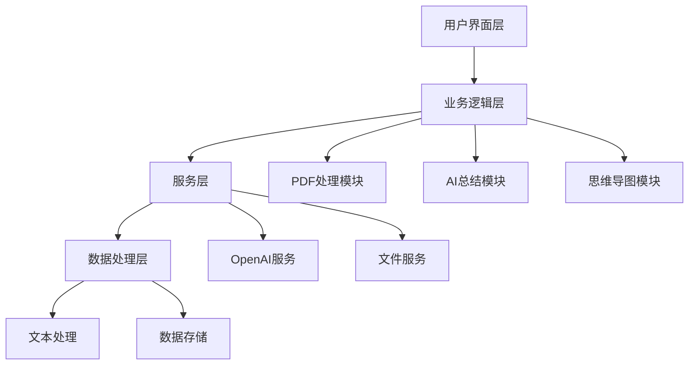
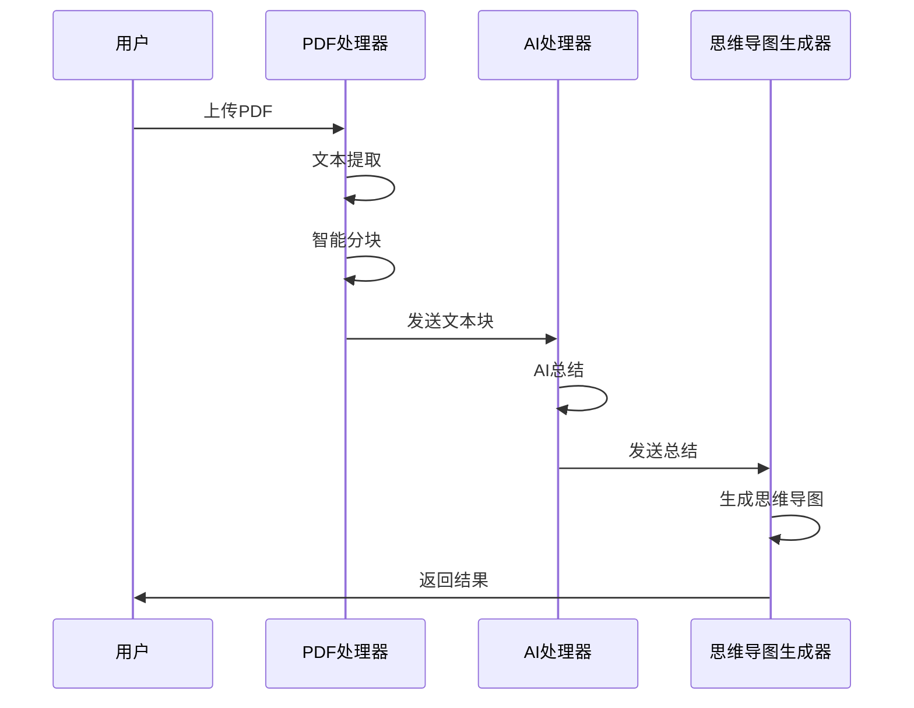

# 基于人工智能的论文批量总结系统

## 1. 引言

本系统是一个基于人工智能技术的论文批量总结工具，旨在帮助学术研究者和学生快速理解和处理大量学术论文。系统利用先进的自然语言处理技术，将复杂的学术论文转化为简洁明了的总结和直观的思维导图，大大提高了学术研究的效率。

## 2. 程序的功能

### 2.1 程序功能简介

本系统是一个集成了PDF处理、AI智能总结、思维导图生成等功能的综合性学术辅助工具。它能够批量处理学术论文，自动生成论文摘要，并以思维导图的形式呈现论文的核心内容，为用户提供了一个高效的学术文献处理解决方案。

### 2.2 详细功能

1. **智能PDF处理**
   - 支持批量上传PDF格式论文
   - 自动提取文本内容
   - 智能分块处理大型文档
   - 支持中英文论文处理

2. **AI智能总结**
   - 基于GPT-4模型的智能总结
   - 支持多种总结模式（简洁/标准）
   - 自动提取论文核心观点
   - 智能分析研究方法和结论

3. **思维导图生成**
   - 自动生成论文结构图
   - 可视化展示论文逻辑关系
   - 支持导图样式自定义
   - 导出高清思维导图图片

4. **多样化导出选项**
   - 支持多种导出格式
   - 批量导出功能
   - 历史记录管理
   - 内容差异对比

## 3. 程序的意义和价值

### 3.1 程序的意义

1. **提升学术效率**
   - 大幅减少论文阅读时间
   - 快速把握论文核心内容
   - 辅助文献综述撰写
   - 促进学术研究效率

2. **知识管理创新**
   - 智能化文献整理
   - 可视化知识展示
   - 便捷的检索和回顾
   - 促进知识积累和共享

3. **教育教学支持**
   - 辅助教师备课和研究
   - 帮助学生理解专业文献
   - 促进教学资源整合
   - 提升教学质量

### 3.2 程序的社会价值与经济价值

1. **社会价值**
   - 推动学术研究效率提升
   - 促进知识传播与共享
   - 降低学术研究门槛
   - 推动教育信息化发展

2. **经济价值**
   - 降低研究成本
   - 提高研究效率
   - 创造市场机会
   - 促进教育科技发展

## 4. 程序的使用说明书

### 4.1 系统要求

1. **基础环境**
   - Python 3.8+
   - 操作系统：Windows/MacOS/Linux
   - 稳定的网络连接

2. **依赖库**
   ```
   streamlit==1.24.0
   openai==1.3.0
   pdfplumber==0.9.0
   graphviz==0.20.1
   python-dotenv==1.0.0
   ```

### 4.2 安装步骤

1. **环境配置**
   ```bash
   # 克隆项目
   git clone [项目地址]
   cd academic-summarize_dv

   # 创建虚拟环境
   python -m venv .venv
   source .venv/bin/activate  # Linux/MacOS
   # 或
   .venv\Scripts\activate  # Windows

   # 安装依赖
   pip install -r requirements.txt
   ```

2. **配置API密钥**
   - 复制`.env.example`为`.env`
   - 在`.env`文件中设置OpenAI API密钥（支持第三方）

### 4.3 使用流程

1. **启动程序**
   ```bash
   streamlit run app.py
   ```

2. **使用步骤**
   - 上传PDF文件
   - 选择总结模式
   - 等待处理完成
   - 查看和导出结果

### 4.4 Windows系统特别说明

1. **环境准备**
   - Python 3.8+ ([Python官网](https://www.python.org/downloads/windows/))
   - Git ([Git官网](https://git-scm.com/download/win))
   - Graphviz ([Graphviz官网](https://graphviz.org/download/))
     * 安装时勾选"添加到系统PATH"
     * 用于生成思维导图

2. **Windows特有步骤**
   ```batch
   :: 激活虚拟环境
   .venv\Scripts\activate

   :: 验证Graphviz安装
   dot -v

   :: 启动应用
   streamlit run app.py
   ```

3. **注意事项**
   - 使用反斜杠 `\` 作为路径分隔符
   - 避免中文路径和特殊字符
   - 推荐使用 Chrome 或 Edge 浏览器
   - 如遇权限问题，使用管理员权限运行命令行

## 5. 程序的核心源代码与核心逻辑的说明

### 5.1 系统架构



### 5.2 核心代码示例

1. **PDF处理模块**
```python
class PDFProcessor:
    def process_batch(self, start_page: int, end_page: int) -> List[str]:
        """处理指定页码范围的PDF内容
        Args:
            start_page: 起始页码
            end_page: 结束页码
        Returns:
            包含文本块的列表
        """
        chunks = []
        current_chunk = ""
        
        with pdfplumber.open(self.file) as pdf:
            for page_num in range(start_page, min(end_page, len(pdf.pages))):
                try:
                    page = pdf.pages[page_num]
                    text = page.extract_text() or ""
                    
                    # 智能分块处理
                    words = text.split()
                    for word in words:
                        if len(current_chunk) + len(word) + 1 > config.CHUNK_SIZE:
                            chunks.append(current_chunk.strip())
                            current_chunk = word
                        else:
                            current_chunk += " " + word
                            
                except Exception as e:
                    continue
                    
        if current_chunk:
            chunks.append(current_chunk.strip())
            
        return chunks
```

2. **AI总结模块**
```python
class OpenAIHandler:
    async def summarize(self, chunks: List[str], mode: str) -> str:
        """并行处理多个文本块
        Args:
            chunks: 文本块列表
            mode: 总结模式
        Returns:
            合并后的总结文本
        """
        tasks = [self.summarize_chunk(chunk, mode) for chunk in chunks]
        summaries = await asyncio.gather(*tasks)
        return self.merge_summaries(summaries)
```

### 5.3 核心算法流程

1. **文档处理流程**


## 6. 系统特性与优化

### 6.1 多平台支持

1. **操作系统兼容**
   - Windows
     * 支持 Windows 10/11
     * 注意路径分隔符使用 `\`
     * 需安装 Graphviz
   - MacOS
     * 支持 10.15+
     * 使用 brew 安装依赖
   - Linux
     * 支持主流发行版
     * 使用包管理器安装依赖

2. **浏览器支持**
   - Chrome（推荐）
   - Edge
   - Firefox
   - Safari

### 6.2 性能优化

1. **并行处理**
   - PDF分块并行处理
   - 异步API调用
   - 多线程文件处理

2. **内存管理**
   - 大文件分块处理
   - 定期清理缓存
   - 智能内存释放

3. **响应优化**
   - 流式响应
   - 进度条显示
   - 状态实时更新

### 6.3 扩展性设计

1. **模型支持**
   - OpenAI官方API
   - 第三方API接入
   - 自定义模型接口

2. **输出格式**
   - Markdown格式
   - 思维导图
   - PDF报告
   - 自定义模板

## 7. 其它需要说明的事项

1. **数据安全**
   - 所有上传的PDF文件仅用于处理，不会永久存储
   - 用户数据严格保密，不会泄露给第三方
   - API密钥通过环境变量安全存储

2. **使用限制**
   - 单个PDF文件不超过100页
   - 文件必须是文本可选择的PDF格式
   - 需要稳定的网络连接

3. **未来展望**
   - 支持更多文件格式
   - 添加协作功能
   - 优化处理效率
   - 增加更多自定义选项

4. **技术支持**
   - 详细的在线文档
   - 及时的问题响应
   - 定期的功能更新
   - 完善的错误处理机制
